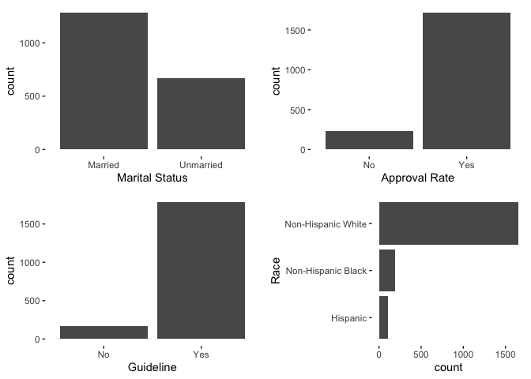
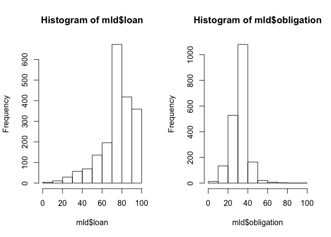
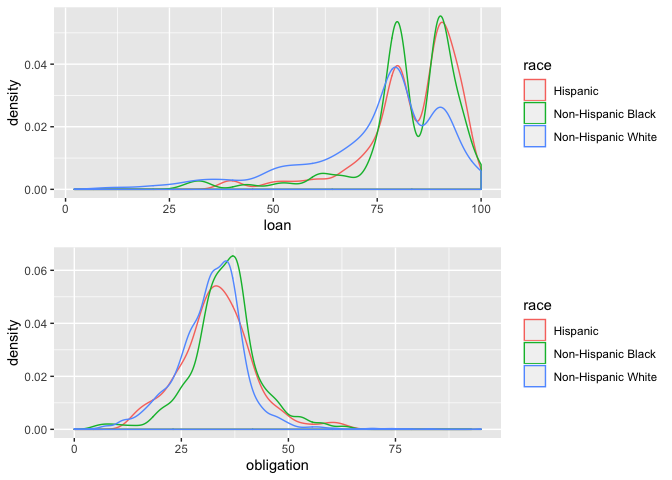
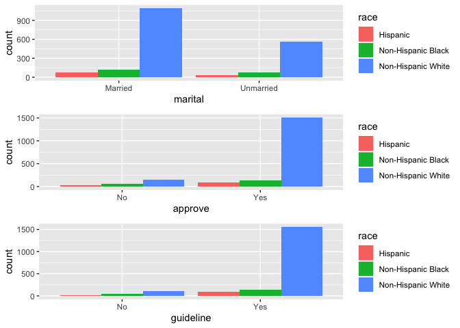
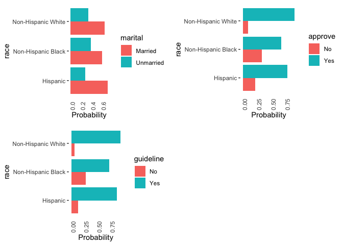
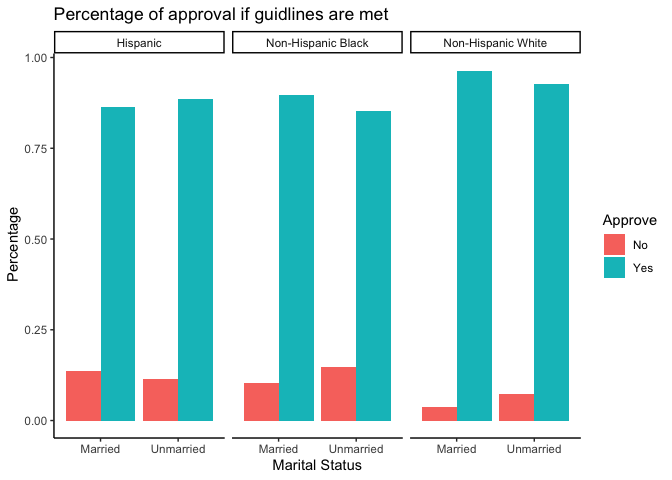
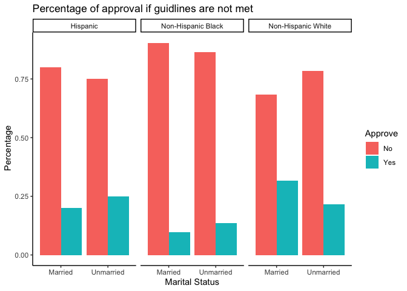

# Sample Selection Criteria 

* There are 3 NAs in Married. Given our data set of almost 2,000 observation, we decided to remove these observations.
* There are values of 666 in "Guideline", which is an impossible value. We decided to remove such observations as well. 
* There are loans that is more than 100% of the purchases price. We decided to remove these observations. 


# Descriptive statistics

## All observations analysis 

* There are twice more married applicants than unmarried applicants. 
* Most of the time, the application is approved (88% approval rate).
* Most application satisfied guidelines (91% of the time). 
* Most applicants are non-Hispanic White (85% White). 


<table class="table" style="width: auto !important; margin-left: auto; margin-right: auto;">
 <thead>
  <tr>
   <th style="text-align:left;"> marital </th>
   <th style="text-align:center;"> n </th>
   <th style="text-align:center;"> percent </th>
  </tr>
 </thead>
<tbody>
  <tr>
   <td style="text-align:left;"> Married </td>
   <td style="text-align:center;"> 1283 </td>
   <td style="text-align:center;"> 66% </td>
  </tr>
  <tr>
   <td style="text-align:left;"> Unmarried </td>
   <td style="text-align:center;"> 669 </td>
   <td style="text-align:center;"> 34% </td>
  </tr>
  <tr>
   <td style="text-align:left;"> Total </td>
   <td style="text-align:center;"> 1952 </td>
   <td style="text-align:center;"> 100% </td>
  </tr>
</tbody>
</table>

<table class="table" style="width: auto !important; margin-left: auto; margin-right: auto;">
 <thead>
  <tr>
   <th style="text-align:left;"> race </th>
   <th style="text-align:center;"> n </th>
   <th style="text-align:center;"> percent </th>
  </tr>
 </thead>
<tbody>
  <tr>
   <td style="text-align:left;"> Hispanic </td>
   <td style="text-align:center;"> 106 </td>
   <td style="text-align:center;"> 5% </td>
  </tr>
  <tr>
   <td style="text-align:left;"> Non-Hispanic Black </td>
   <td style="text-align:center;"> 194 </td>
   <td style="text-align:center;"> 10% </td>
  </tr>
  <tr>
   <td style="text-align:left;"> Non-Hispanic White </td>
   <td style="text-align:center;"> 1652 </td>
   <td style="text-align:center;"> 85% </td>
  </tr>
  <tr>
   <td style="text-align:left;"> Total </td>
   <td style="text-align:center;"> 1952 </td>
   <td style="text-align:center;"> 100% </td>
  </tr>
</tbody>
</table>

<table class="table" style="width: auto !important; margin-left: auto; margin-right: auto;">
 <thead>
  <tr>
   <th style="text-align:left;"> approve </th>
   <th style="text-align:center;"> n </th>
   <th style="text-align:center;"> percent </th>
  </tr>
 </thead>
<tbody>
  <tr>
   <td style="text-align:left;"> No </td>
   <td style="text-align:center;"> 235 </td>
   <td style="text-align:center;"> 12% </td>
  </tr>
  <tr>
   <td style="text-align:left;"> Yes </td>
   <td style="text-align:center;"> 1717 </td>
   <td style="text-align:center;"> 88% </td>
  </tr>
  <tr>
   <td style="text-align:left;"> Total </td>
   <td style="text-align:center;"> 1952 </td>
   <td style="text-align:center;"> 100% </td>
  </tr>
</tbody>
</table>

<table class="table" style="width: auto !important; margin-left: auto; margin-right: auto;">
 <thead>
  <tr>
   <th style="text-align:left;"> guideline </th>
   <th style="text-align:center;"> n </th>
   <th style="text-align:center;"> percent </th>
  </tr>
 </thead>
<tbody>
  <tr>
   <td style="text-align:left;"> No </td>
   <td style="text-align:center;"> 167 </td>
   <td style="text-align:center;"> 9% </td>
  </tr>
  <tr>
   <td style="text-align:left;"> Yes </td>
   <td style="text-align:center;"> 1785 </td>
   <td style="text-align:center;"> 91% </td>
  </tr>
  <tr>
   <td style="text-align:left;"> Total </td>
   <td style="text-align:center;"> 1952 </td>
   <td style="text-align:center;"> 100% </td>
  </tr>
</tbody>
</table>


<!-- -->

* Most loans is at 70-80% of the item purchase price. 
* Most other obligations is at 30-40% of the loan-applicant's total income. 


<!-- -->

## Descriptive statistics by race/ethnicity

* Distribution of loan/purchase price is hightly skewed left. Most people apply for high proportion of loan over price. 
    + Hispanic and Non-Hispanic Black have higher average loan amount application. 
* Across races/ethnicities, people have similar percentage of other obligations over income (about 32-35% of income). 

<table class="table" style="width: auto !important; margin-left: auto; margin-right: auto;">
<caption>Descriptive Table for Continuous variables</caption>
 <thead>
  <tr>
   <th style="text-align:left;"> race </th>
   <th style="text-align:right;"> Loan (mean) </th>
   <th style="text-align:right;"> Loan (median) </th>
   <th style="text-align:right;"> Loan (sd) </th>
   <th style="text-align:right;"> Other Oblig.(mean) </th>
   <th style="text-align:right;"> Other Oblig.(median) </th>
   <th style="text-align:right;"> Other Oblig. (sd) </th>
  </tr>
 </thead>
<tbody>
  <tr>
   <td style="text-align:left;"> Hispanic </td>
   <td style="text-align:right;"> 83.5 </td>
   <td style="text-align:right;"> 88.8 </td>
   <td style="text-align:right;"> 11.7 </td>
   <td style="text-align:right;"> 33.3 </td>
   <td style="text-align:right;"> 33.0 </td>
   <td style="text-align:right;"> 8.6 </td>
  </tr>
  <tr>
   <td style="text-align:left;"> Non-Hispanic Black </td>
   <td style="text-align:right;"> 82.8 </td>
   <td style="text-align:right;"> 84.2 </td>
   <td style="text-align:right;"> 12.6 </td>
   <td style="text-align:right;"> 35.1 </td>
   <td style="text-align:right;"> 35.0 </td>
   <td style="text-align:right;"> 8.1 </td>
  </tr>
  <tr>
   <td style="text-align:left;"> Non-Hispanic White </td>
   <td style="text-align:right;"> 74.8 </td>
   <td style="text-align:right;"> 79.9 </td>
   <td style="text-align:right;"> 17.1 </td>
   <td style="text-align:right;"> 32.0 </td>
   <td style="text-align:right;"> 32.5 </td>
   <td style="text-align:right;"> 8.2 </td>
  </tr>
</tbody>
</table>

<!-- --><!-- -->

* Most White applicants have their application accepted (91%). Black people has the lowest acceptance rate (67%).
* White applicants also have the highest percentage of applications that satisfy the guidelines, while black applicant have the lowest percentage of applications that satisfy the guidelines. 


<table class="table" style="width: auto !important; margin-left: auto; margin-right: auto;">
<caption>Approval Rate by Race/Ethnicity</caption>
 <thead>
  <tr>
   <th style="text-align:left;"> race </th>
   <th style="text-align:center;"> No </th>
   <th style="text-align:center;"> Yes </th>
   <th style="text-align:left;"> Total </th>
  </tr>
 </thead>
<tbody>
  <tr>
   <td style="text-align:left;"> Hispanic </td>
   <td style="text-align:center;"> 22% </td>
   <td style="text-align:center;"> 78% </td>
   <td style="text-align:left;"> 100% </td>
  </tr>
  <tr>
   <td style="text-align:left;"> Non-Hispanic Black </td>
   <td style="text-align:center;"> 33% </td>
   <td style="text-align:center;"> 67% </td>
   <td style="text-align:left;"> 100% </td>
  </tr>
  <tr>
   <td style="text-align:left;"> Non-Hispanic White </td>
   <td style="text-align:center;"> 9% </td>
   <td style="text-align:center;"> 91% </td>
   <td style="text-align:left;"> 100% </td>
  </tr>
</tbody>
</table>

<!-- -->


```r
# Only select individuals who met guidline
sub1 <- mld %>%
  filter(guideline == "Yes") %>%
  group_by(marital, race, approve) %>%
  summarise(count=n()) %>%
  group_by(marital,race) %>%
  mutate(percentage = (count/sum(count))) %>%
  ggplot(aes(x = marital, y = percentage, fill = approve)) +
    geom_bar(stat = "identity", position = "dodge") +
    labs(fill = "Approve") +
    labs(x = "Marital Status", y = " Percentage") +
    theme(text = element_text(size = 20)) + 
  facet_wrap(~race) +
  theme_classic()+
  ggtitle("Percentage of approval if guidlines are met")
  
sub1
```

<!-- -->

+ If applicants met the guidlines, black and hispanic applicants still have lower approval rate than white applicants.

+ For Hispanic candidates, married applicants have higher declined rate than unmarried if guidlines are met. 

+ For white and black candidates, if guidlines are met, unmarried applicants have higher decliend rate.


```r
# Only select individuals who didn't meet guidline
sub2 <- mld %>%
  filter(guideline == "No") %>%
  group_by(marital, race, approve) %>%
  summarise(count=n()) %>%
  group_by(marital,race) %>%
  mutate(percentage = (count/sum(count))) %>%
  ggplot(aes(x = marital, y = percentage, fill = approve)) +
    geom_bar(stat = "identity", position = "dodge") +
    labs(fill = "Approve") +
    labs(x = "Marital Status", y = " Percentage") +
    theme(text = element_text(size = 20)) + 
  facet_wrap(~race) +
  theme_classic()+
  ggtitle("Percentage of approval if guidlines are not met")
  
sub2
```

<!-- -->

+ If guidlines are not met, white married applicants have highest approval rate.

+ Black candidates still have lowest approval rate. 

+ Only for black candidates, married applicants have lower approval rate than unmarried applicants.


```r
mld$approve <- ifelse(mld$approve == "Yes", 1, 0)

mld_hispanic <- filter(mld, race == "Hispanic")
mld_white <- filter(mld, race == "Non-Hispanic White")
mld_black <- filter(mld, race == "Non-Hispanic Black")
```


# Probit Model

## Overall


```r
probit_all <- glm(approve ~ guideline + obligation + loan + marital, family = binomial(link = "probit"), data = mld)

summary(probit_all)
```

```
## 
## Call:
## glm(formula = approve ~ guideline + obligation + loan + marital, 
##     family = binomial(link = "probit"), data = mld)
## 
## Deviance Residuals: 
##     Min       1Q   Median       3Q      Max  
## -2.9538   0.2481   0.3262   0.3843   2.2741  
## 
## Coefficients:
##                   Estimate Std. Error z value Pr(>|z|)    
## (Intercept)       0.706151   0.330597   2.136  0.03268 *  
## guidelineYes      2.237594   0.120617  18.551  < 2e-16 ***
## obligation       -0.017212   0.005427  -3.171  0.00152 ** 
## loan             -0.009288   0.003258  -2.851  0.00436 ** 
## maritalUnmarried -0.226565   0.090717  -2.497  0.01251 *  
## ---
## Signif. codes:  0 '***' 0.001 '**' 0.01 '*' 0.05 '.' 0.1 ' ' 1
## 
## (Dispersion parameter for binomial family taken to be 1)
## 
##     Null deviance: 1435.5  on 1951  degrees of freedom
## Residual deviance:  943.4  on 1947  degrees of freedom
## AIC: 953.4
## 
## Number of Fisher Scoring iterations: 6
```

Coefficients make intuitive directional sense; marriage could be positive or negative intuitively.


## Hispanic


```r
probit_hispanic <- glm(approve ~ guideline + obligation + loan + marital, family = binomial(link = "probit"), data = mld_hispanic)

summary(probit_hispanic)
```

```
## 
## Call:
## glm(formula = approve ~ guideline + obligation + loan + marital, 
##     family = binomial(link = "probit"), data = mld_hispanic)
## 
## Deviance Residuals: 
##     Min       1Q   Median       3Q      Max  
## -2.8208   0.1887   0.4173   0.5647   1.8554  
## 
## Coefficients:
##                   Estimate Std. Error z value Pr(>|z|)    
## (Intercept)       1.370350   1.421466   0.964   0.3350    
## guidelineYes      1.837323   0.431041   4.263 2.02e-05 ***
## obligation       -0.051577   0.020134  -2.562   0.0104 *  
## loan             -0.004412   0.013730  -0.321   0.7480    
## maritalUnmarried  0.229874   0.372176   0.618   0.5368    
## ---
## Signif. codes:  0 '***' 0.001 '**' 0.01 '*' 0.05 '.' 0.1 ' ' 1
## 
## (Dispersion parameter for binomial family taken to be 1)
## 
##     Null deviance: 110.889  on 105  degrees of freedom
## Residual deviance:  77.094  on 101  degrees of freedom
## AIC: 87.094
## 
## Number of Fisher Scoring iterations: 6
```

Coefficients make intuitive directional sense; marriage could be positive or negative intuitively.


## Non-Hispanic Black


```r
probit_black <- glm(approve ~ guideline + obligation + loan + marital, family = binomial(link = "probit"), data = mld_black)

summary(probit_black)
```

```
## 
## Call:
## glm(formula = approve ~ guideline + obligation + loan + marital, 
##     family = binomial(link = "probit"), data = mld_black)
## 
## Deviance Residuals: 
##     Min       1Q   Median       3Q      Max  
## -2.1673  -0.4516   0.4770   0.5236   2.3542  
## 
## Coefficients:
##                   Estimate Std. Error z value Pr(>|z|)    
## (Intercept)      -0.342697   0.955850  -0.359    0.720    
## guidelineYes      2.352888   0.267243   8.804   <2e-16 ***
## obligation       -0.018236   0.015688  -1.162    0.245    
## loan             -0.002150   0.009906  -0.217    0.828    
## maritalUnmarried -0.052505   0.244956  -0.214    0.830    
## ---
## Signif. codes:  0 '***' 0.001 '**' 0.01 '*' 0.05 '.' 0.1 ' ' 1
## 
## (Dispersion parameter for binomial family taken to be 1)
## 
##     Null deviance: 246.03  on 193  degrees of freedom
## Residual deviance: 139.53  on 189  degrees of freedom
## AIC: 149.53
## 
## Number of Fisher Scoring iterations: 5
```

Coefficients make intuitive directional sense; marriage could be positive or negative intuitively.

## Non-Hispanic White


```r
probit_white <- glm(approve ~ guideline + obligation + loan + marital, family = binomial(link = "probit"), data = mld_white)

summary(probit_white)
```

```
## 
## Call:
## glm(formula = approve ~ guideline + obligation + loan + marital, 
##     family = binomial(link = "probit"), data = mld_white)
## 
## Deviance Residuals: 
##     Min       1Q   Median       3Q      Max  
## -2.9776   0.2343   0.2951   0.3489   1.9230  
## 
## Coefficients:
##                   Estimate Std. Error z value Pr(>|z|)    
## (Intercept)       0.670615   0.372074   1.802   0.0715 .  
## guidelineYes      2.169039   0.146980  14.757   <2e-16 ***
## obligation       -0.012800   0.006137  -2.086   0.0370 *  
## loan             -0.008405   0.003613  -2.326   0.0200 *  
## maritalUnmarried -0.304284   0.103568  -2.938   0.0033 ** 
## ---
## Signif. codes:  0 '***' 0.001 '**' 0.01 '*' 0.05 '.' 0.1 ' ' 1
## 
## (Dispersion parameter for binomial family taken to be 1)
## 
##     Null deviance: 996.44  on 1651  degrees of freedom
## Residual deviance: 702.80  on 1647  degrees of freedom
## AIC: 712.8
## 
## Number of Fisher Scoring iterations: 6
```

Coefficients make intuitive directional sense; marriage could be positive or negative intuitively.

# Logit Model & Odds Ratios

## Overall

```r
logit <- glm(approve ~ guideline + obligation + loan  + marital, data = mld, family = "binomial")

summary(logit)
```

```
## 
## Call:
## glm(formula = approve ~ guideline + obligation + loan + marital, 
##     family = "binomial", data = mld)
## 
## Deviance Residuals: 
##     Min       1Q   Median       3Q      Max  
## -2.9041   0.2520   0.3250   0.3831   2.3355  
## 
## Coefficients:
##                  Estimate Std. Error z value Pr(>|z|)    
## (Intercept)       1.81919    0.66840   2.722 0.006494 ** 
## guidelineYes      3.87929    0.21745  17.840  < 2e-16 ***
## obligation       -0.03561    0.01052  -3.386 0.000709 ***
## loan             -0.02003    0.00697  -2.874 0.004052 ** 
## maritalUnmarried -0.46339    0.18316  -2.530 0.011408 *  
## ---
## Signif. codes:  0 '***' 0.001 '**' 0.01 '*' 0.05 '.' 0.1 ' ' 1
## 
## (Dispersion parameter for binomial family taken to be 1)
## 
##     Null deviance: 1435.50  on 1951  degrees of freedom
## Residual deviance:  943.38  on 1947  degrees of freedom
## AIC: 953.38
## 
## Number of Fisher Scoring iterations: 6
```

```r
logitor(approve ~ guideline + obligation + loan + marital, data = mld)
```

```
## Call:
## logitor(formula = approve ~ guideline + obligation + loan + marital, 
##     data = mld)
## 
## Odds Ratio:
##                   OddsRatio  Std. Err.       z     P>|z|    
## guidelineYes     48.3900580 10.5226087 17.8396 < 2.2e-16 ***
## obligation        0.9650180  0.0101483 -3.3861  0.000709 ***
## loan              0.9801658  0.0068321 -2.8741  0.004052 ** 
## maritalUnmarried  0.6291476  0.1152360 -2.5299  0.011408 *  
## ---
## Signif. codes:  0 '***' 0.001 '**' 0.01 '*' 0.05 '.' 0.1 ' ' 1
```

+ Keeping all other variable constant, applicants who met guidelines have 48.4 times greater odds than applicants who didn't meet guidelines to get loan approval. The coefficient is statistically significant at 1% level.

## Hispanic


```r
logit <- glm(approve ~ guideline + obligation + loan + marital, data = mld_hispanic, family = "binomial")

summary(logit)
```

```
## 
## Call:
## glm(formula = approve ~ guideline + obligation + loan + marital, 
##     family = "binomial", data = mld_hispanic)
## 
## Deviance Residuals: 
##     Min       1Q   Median       3Q      Max  
## -2.8528   0.1961   0.3997   0.5437   1.9369  
## 
## Coefficients:
##                  Estimate Std. Error z value Pr(>|z|)    
## (Intercept)       3.36603    2.66062   1.265  0.20582    
## guidelineYes      3.13975    0.77366   4.058 4.94e-05 ***
## obligation       -0.10904    0.03878  -2.812  0.00492 ** 
## loan             -0.01023    0.02576  -0.397  0.69137    
## maritalUnmarried  0.32415    0.69741   0.465  0.64208    
## ---
## Signif. codes:  0 '***' 0.001 '**' 0.01 '*' 0.05 '.' 0.1 ' ' 1
## 
## (Dispersion parameter for binomial family taken to be 1)
## 
##     Null deviance: 110.889  on 105  degrees of freedom
## Residual deviance:  75.823  on 101  degrees of freedom
## AIC: 85.823
## 
## Number of Fisher Scoring iterations: 5
```

```r
logitor(approve ~ guideline + obligation + loan + marital, data = mld_hispanic)
```

```
## Call:
## logitor(formula = approve ~ guideline + obligation + loan + marital, 
##     data = mld_hispanic)
## 
## Odds Ratio:
##                  OddsRatio Std. Err.       z     P>|z|    
## guidelineYes     23.098153 17.870013  4.0583 4.942e-05 ***
## obligation        0.896697  0.034769 -2.8120  0.004923 ** 
## loan              0.989825  0.025498 -0.3970  0.691368    
## maritalUnmarried  1.382851  0.964409  0.4648  0.642082    
## ---
## Signif. codes:  0 '***' 0.001 '**' 0.01 '*' 0.05 '.' 0.1 ' ' 1
```

+ Keeping all other variable constant, applicants who met guidelines have 23.1 times greater odds than applicants who didn't meet guidelines to get loan approval. The coefficient is statistically significant at 1% level.

## Non-Hispanic Black


```r
logit <- glm(approve ~ guideline + obligation + loan + marital, data = mld_black, family = "binomial")

summary(logit)
```

```
## 
## Call:
## glm(formula = approve ~ guideline + obligation + loan + marital, 
##     family = "binomial", data = mld_black)
## 
## Deviance Residuals: 
##     Min       1Q   Median       3Q      Max  
## -2.1621  -0.4449   0.4766   0.5244   2.3528  
## 
## Coefficients:
##                   Estimate Std. Error z value Pr(>|z|)    
## (Intercept)      -0.499613   1.805853  -0.277    0.782    
## guidelineYes      4.017867   0.511204   7.860 3.85e-15 ***
## obligation       -0.033738   0.029706  -1.136    0.256    
## loan             -0.003658   0.018894  -0.194    0.846    
## maritalUnmarried -0.123233   0.464227  -0.265    0.791    
## ---
## Signif. codes:  0 '***' 0.001 '**' 0.01 '*' 0.05 '.' 0.1 ' ' 1
## 
## (Dispersion parameter for binomial family taken to be 1)
## 
##     Null deviance: 246.03  on 193  degrees of freedom
## Residual deviance: 139.56  on 189  degrees of freedom
## AIC: 149.56
## 
## Number of Fisher Scoring iterations: 5
```

```r
logitor(approve ~ guideline + obligation + loan + marital, data = mld_black)
```

```
## Call:
## logitor(formula = approve ~ guideline + obligation + loan + marital, 
##     data = mld_black)
## 
## Odds Ratio:
##                  OddsRatio Std. Err.       z     P>|z|    
## guidelineYes     55.582396 28.413936  7.8596 3.853e-15 ***
## obligation        0.966825  0.028720 -1.1357    0.2561    
## loan              0.996349  0.018825 -0.1936    0.8465    
## maritalUnmarried  0.884058  0.410403 -0.2655    0.7907    
## ---
## Signif. codes:  0 '***' 0.001 '**' 0.01 '*' 0.05 '.' 0.1 ' ' 1
```

+ Keeping all other variable constant, applicants who met guidelines have 55.6 times greater odds than applicants who didn't meet guidelines to get loan approval. The coefficient is statistically significant at 1% level.


## Non-Hispanic White

```r
logit <- glm(approve ~ guideline + obligation + loan + marital, data = mld_white, family = "binomial")

summary(logit)
```

```
## 
## Call:
## glm(formula = approve ~ guideline + obligation + loan + marital, 
##     family = "binomial", data = mld_white)
## 
## Deviance Residuals: 
##     Min       1Q   Median       3Q      Max  
## -2.9357   0.2371   0.2947   0.3466   1.9661  
## 
## Coefficients:
##                   Estimate Std. Error z value Pr(>|z|)    
## (Intercept)       1.734492   0.769327   2.255  0.02416 *  
## guidelineYes      3.800259   0.259848  14.625  < 2e-16 ***
## obligation       -0.026067   0.012081  -2.158  0.03095 *  
## loan             -0.018910   0.007926  -2.386  0.01704 *  
## maritalUnmarried -0.633934   0.213946  -2.963  0.00305 ** 
## ---
## Signif. codes:  0 '***' 0.001 '**' 0.01 '*' 0.05 '.' 0.1 ' ' 1
## 
## (Dispersion parameter for binomial family taken to be 1)
## 
##     Null deviance: 996.44  on 1651  degrees of freedom
## Residual deviance: 703.03  on 1647  degrees of freedom
## AIC: 713.03
## 
## Number of Fisher Scoring iterations: 6
```

```r
logitor(approve ~ guideline + obligation + loan + marital, data = mld_white)
```

```
## Call:
## logitor(formula = approve ~ guideline + obligation + loan + marital, 
##     data = mld_white)
## 
## Odds Ratio:
##                   OddsRatio  Std. Err.       z     P>|z|    
## guidelineYes     44.7127817 11.6185202 14.6249 < 2.2e-16 ***
## obligation        0.9742694  0.0117702 -2.1577  0.030950 *  
## loan              0.9812674  0.0077778 -2.3858  0.017043 *  
## maritalUnmarried  0.5305006  0.1134986 -2.9631  0.003046 ** 
## ---
## Signif. codes:  0 '***' 0.001 '**' 0.01 '*' 0.05 '.' 0.1 ' ' 1
```

+ Keeping all other variable constant, applicants who met guidelines have 44.7 times greater odds than applicants who didn't meet guidelines to get loan approval. The coefficient is statistically significant at 1% level.
